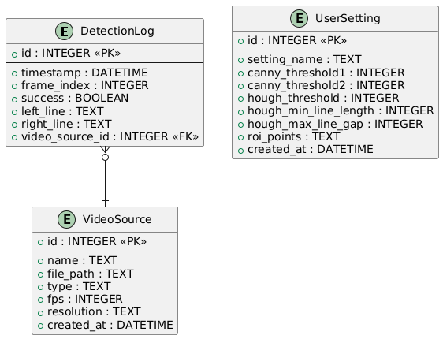

# Физическая модель базы данных

## Назначение
Хранение настроек алгоритма, источников видео и логов распознавания.

## ER-диаграмма

## SQL
Файл: [schema.sql](schema.sql)

## Таблицы
- **VideoSource**: видеофайлы или камеры
- **UserSetting**: параметры Canny, Hough, ROI
- **DetectionLog**: результаты распознавания по кадрам